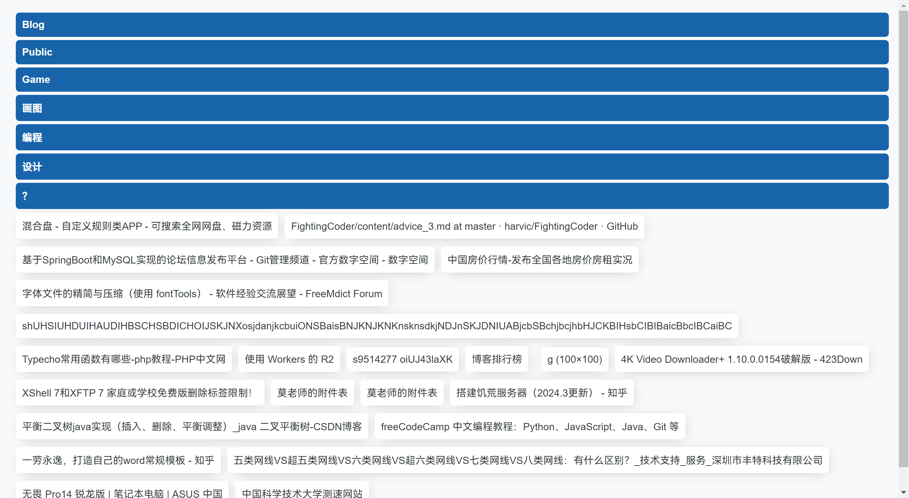
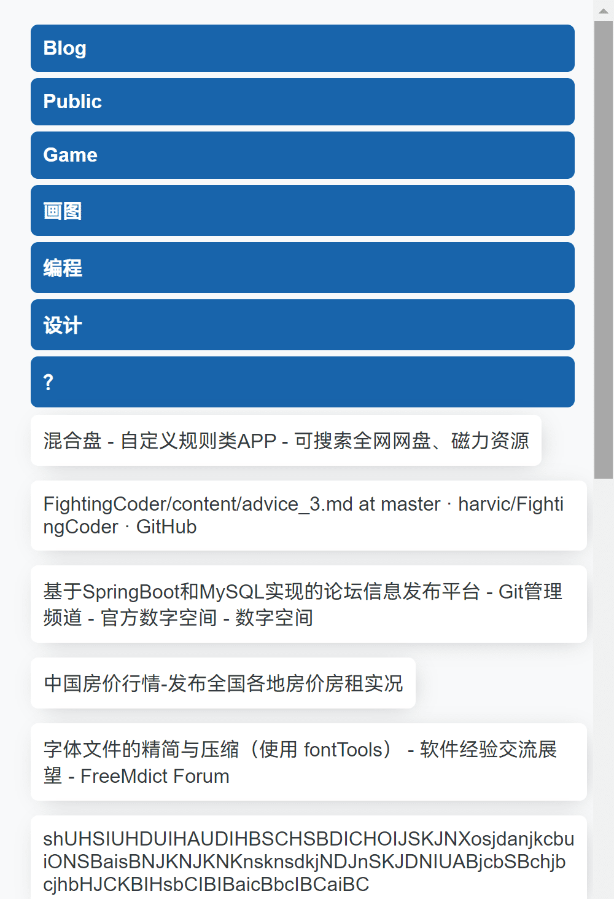

## 这是什么

这是一个用于生成移动书签网页的脚本，你可以在你的Chrome浏览器导出你的书签，然后使用该脚本，就能得到一个网页，将该网页上传至你的服务器主机，你就能在任何地方使用浏览器访问你的书签

## 如何使用

1. 确保你的电脑拥有 [Node](https://nodejs.org/) 环境或 [Python](https://python.org/) 环境

2. 导出你的Chrome书签，并将它重命名为`bookmarks.html`

3. 复制`bookmarks.html`到`script`目录下

4. 如果你使用Nodejs，打开CMD执行以下命令

   ```javascript
   //如果你未安装cheerio库，可以通过以下命令安装：
   //npm install cheerio
   node generate_data.js
   ```
   如果你使用Python，执行以下命令
   ```python
   # 如果你未安装BeautifulSoup库，可以通过以下命令安装：
   # pip install beautifulsoup4
   py generate_data.py
   ```

5. 复制在`script`目录下生成的`data.json`和`dist`目录下的`index.html`，放到你的云服务器主机下即可访问

## 截图





---

## What is this?

This is a script for generating mobile bookmark web pages. You can export your bookmarks in your Chrome browser, and then use this script to get a web page, upload it to your server host, and you can access your bookmarks anywhere with your browser.

## How to use it

1. Make sure your computer has a [Node](https://nodejs.org/) environment or a [Python](https://python.org/) environment.

2. Export your Chrome bookmark and rename it `bookmarks.html`.

3. Copy' bookmarks.html' to the' script' directory.

4. if you use Nodejs, open CMD and execute the following command.

```javascript
//If you don't have the cheerio library installed, you can install it by the following command:
//npm install cheerio
node generate_data.js
```
If you use Python, execute the following command.
```python
# If you have not installed the BeautifulSoup library, you can install it by the following command:
# pip install beautifulsoup4
py generate_data.py
```

5. Copy the data.json generated in the script directory and the `index.html` in the dist ` directory, and put them under your cloud server host to access them.

## screenshot


